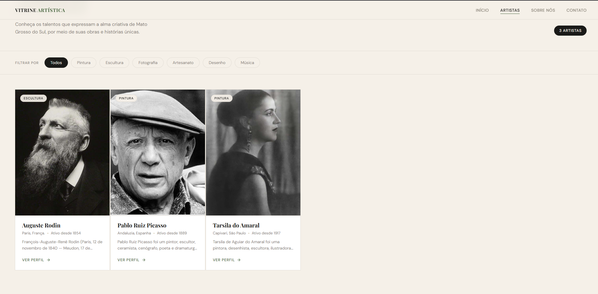

# 🎨 Vitrine Artística de Jardim




Plataforma dedicada a celebrar e difundir a arte e a cultura dos talentos regionais de Jardim, Mato Grosso do Sul.

## ✨ Funcionalidades

- ✅ Listagem de artistas locais com cards visuais
- ✅ Filtro por categoria (Pintura, Escultura, Fotografia, Artesanato, Desenho, Música)
- ✅ Contador dinâmico de artistas cadastrados
- ✅ Dados carregados em tempo real via Supabase
- ✅ Chave da API protegida via Serverless Function (sem exposição no front-end)
- ✅ Deploy automatizado via Vercel + GitHub

## 🛠️ Tecnologias

- **Frontend:** HTML5, CSS3, JavaScript (Vanilla)
- **Banco de Dados:** Supabase (PostgreSQL)
- **Backend:** Vercel Serverless Functions (Node.js)
- **Deploy:** Vercel + GitHub

## 🚀 Como rodar localmente

### Pré-requisitos

- [Node.js](https://nodejs.org/) (para rodar o Vercel CLI)
- [Git](https://git-scm.com/downloads)
- Conta no [Supabase](https://supabase.com) com a tabela `artistas` criada
- Editor de código ([VSCode recomendado](https://code.visualstudio.com/))

### Passo 1: Clonar o repositório

```bash
git clone https://github.com/Jotshh/Vitrine-Artistica.git
cd Vitrine-Artistica
```

### Passo 2: Instalar o Vercel CLI

```bash
npm install -g vercel
```

### Passo 3: Configurar variáveis de ambiente

Copie o arquivo de exemplo:

```bash
cp .env.example .env.local
```

Edite o `.env.local` com suas credenciais do Supabase:

```env
SUPABASE_URL=https://seu-projeto.supabase.co
SUPABASE_KEY=sua_chave_anon_aqui
```

> ⚠️ **Nunca commite o arquivo `.env.local`!** Ele já está no `.gitignore`.

### Passo 4: Rodar o servidor local

```bash
vercel dev
```

Acesse: 🌐 http://localhost:3000

## 🗄️ Estrutura do banco de dados

A tabela `artistas` no Supabase deve conter as seguintes colunas:

| Coluna | Tipo | Descrição |
|---|---|---|
| `id` | int8 | Chave primária |
| `nome` | text | Nome do artista |
| `categoria` | text | Ex: Pintura, Escultura... |
| `localizacao` | text | Cidade, Estado |
| `ano_inicio` | int4 | Ano de início da atividade |
| `descricao` | text | Biografia curta |
| `imagem_url` | text | URL da foto do artista |

## 📁 Estrutura do projeto

```
Vitrine-Artistica/
├── api/
│   └── artistas.js       # Serverless Function (chave protegida aqui)
├── assets/
│   └── favicon.ico
├── css/
│   └── style.css
├── js/
│   └── app.js            # Lógica do front-end
├── pages/
│   └── sobre-nos.html
├── index.html
├── vercel.json
├── .env.example
├── .gitignore
└── README.md
```

## 🔐 Segurança

A chave da API do Supabase **nunca é exposta no navegador**. Toda comunicação com o banco de dados passa pela Serverless Function em `/api/artistas.js`, que roda no servidor do Vercel e lê a chave de variáveis de ambiente privadas.

```
Navegador → /api/artistas (Vercel) → Supabase
```

## ☁️ Deploy

O projeto está configurado para deploy automático via Vercel. A cada `git push` na branch `main`, um novo deploy é iniciado automaticamente.

Para configurar as variáveis de ambiente em produção, acesse:
**Vercel → Settings → Environment Variables** e adicione `SUPABASE_URL` e `SUPABASE_KEY`.

## Motivações

Ao buscarmos sobre os artistas regionais é notório observar que há um déficit na valorização da produção artística, não somente em nossa região como também no país. Pode-se notar ainda, que não há um meio de comunicação especializado para que os habitantes de Jardim e os seus diversos artistas possam divulgar a sua arte de forma mais ampla e abrangente, causando de certo modo, um desconhecimento da cultura regional. Sendo assim, este projeto tem como objetivo principal a divulgação e, sobretudo, a valorização das diferentes expressões de arte da região sudoeste do Mato Grosso do Sul, inicialmente o município de Jardim, sendo este o pontapé inicial de nossos estudos. A ideia era ter feito com primordialmento com os artistas de Jardim, mas na época não deu certo, hoje em dia, poderíamos refazer a pesquisa de meu tcc e verificarmos nossos artistas regionais.

## 📄 Licença

Este projeto está licenciado sob a MIT License.

## 💬 Suporte

Email: josiephelipel265@gmail.com
